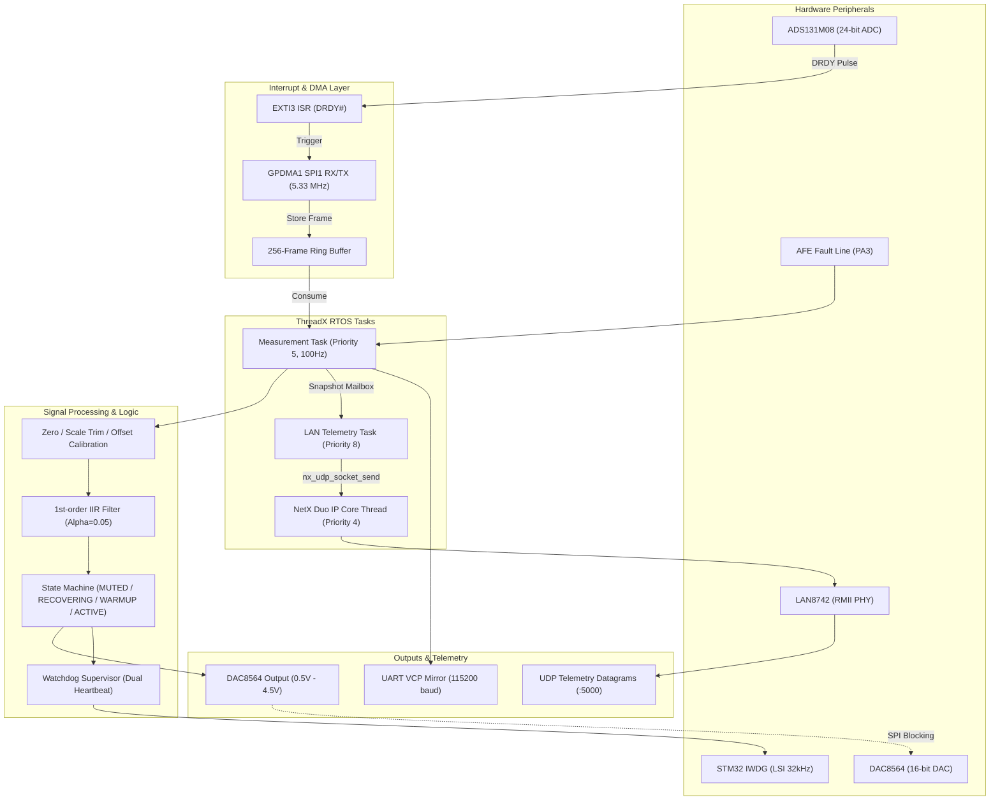

# COSMOKE H563 Firmware

[](https://www.st.com/en/microcontrollers-microprocessors/stm32h563zi.html)
[](https://github.com/eclipse-threadx/threadx)
[](https://github.com/eclipse-threadx/netxduo)
[-red.svg)](https://www.ti.com/product/ADS131M08)
[-orange.svg)](https://www.ti.com/product/DAC8564)
[]()
[]()

**COSMOKE H563**는 **STM32H563ZIT6** 마이크로컨트롤러(Arm Cortex-M33 @ 250 MHz) 기반의 **4채널 고정밀 전류·전압 계측 및 아날로그 절연 출력 제어 펌웨어**입니다.  
TI사의 24-bit 동시 샘플링 ADC **ADS131M08**과 16-bit 4채널 DAC **DAC8564**를 고신뢰성 공유 SPI 버스로 제어하며, **Azure RTOS(ThreadX)** 및 **NetX Duo** 네트워크 스택을 통해 실시간 UDP 및 UART 텔레메트리를 제공합니다.

---

## 📌 주요 특징 (Key Features)

- **고정밀 4채널 동시 계측 (High-Precision 4-Ch Sampling)**:
  - ADS131M08 24-bit $\Delta\Sigma$ ADC (2,000 SPS, OSR 2048, High-Resolution 모드)
  - DRDY 하드웨어 인터럽트 + GPDMA1 원형 링버퍼(256-frame) 비동기 수집
  - 채널별 1차 IIR 디지털 저역통과 필터(LPF) 적용
- **안전 아날로그 출력 (Safe 4-Ch Analog Output)**:
  - TI DAC8564 16-bit 4채널 출력 ($0.5\text{ V} \sim 4.5\text{ V}$ 스팬, $2.5\text{ V}$ 센터/안전 코드)
  - 100 Hz 주기 갱신 및 연속 전송 검증 기반 Health 상태 판정
- **실시간 텔레메트리 & 원격 관제 (Real-time Telemetry & Dashboard)**:
  - NetX Duo 기반 10 Hz UDP 브로드캐스트/유니캐스트 텔레메트리 (기본 포트: `5000`)
  - ST-LINK Virtual COM Port (115200 8N1) UART 동시 미러링
  - 25-필드 확장 CSV 포맷(기본) 및 64-Byte 고속 Binary 포맷(v1) 지원
  - Python Tkinter 기반 경량 실시간 대시보드 (`cosmoke_dashboard.py`) 제공
- **산업용 고신뢰성 방어 설계 (Fail-Safe & Fault-Tolerant Architecture)**:
  - 공유 SPI 버스 중재(Arbitration) 및 Recovery Gate 기반 자율 복구 메커니즘
  - ADS131M08 하드웨어 CRC-16/CCITT 무결성 검증 및 연속 오류 감시
  - 이중 하트비트 감시형 독립 워치독(IWDG) 슈퍼바이저 (계측 태스크 + 네트워크 태스크)
  - 이더넷 링크 핫플러그(케이블 재연결) 자동 복구 (MCU 리셋 불필요)

---

## 🏗️ 시스템 아키텍처 (System Architecture)



---

## 핀 매핑 및 인터페이스 (Hardware Interfaces)

### 1. SPI1 버스 (공유 인터페이스: 5.33 MHz, CPOL=0, CPHA=1)

| 신호명 | STM32H563 핀 | 방향 | 설명 |
|---|---|---|---|
| **SPI1_SCK** | `PA5` | Output | SPI 클록 (공유) |
| **SPI1_MISO** | `PG9` | Input | 마스터 입력 / 슬레이브 출력 (공유) |
| **SPI1_MOSI** | `PB5` | Output | 마스터 출력 / 슬레이브 입력 (공유) |
| **ADC_CS_N** | `PD14` | Output | ADS131M08 Chip Select (Active-Low) |
| **ADC_RESET_N**| `PA0` | Output | ADS131M08 Hardware Reset (Active-Low) |
| **ADC_DRDY_N** | `PF3` | Input | ADS131M08 Data Ready (EXTI3 Falling Edge) |
| **DAC_CS_N** | `PG10` | Output | DAC8564 Chip Select (Active-Low) |
| **SENSOR_FAULT**| `PA3` | Input | AFE 아날로그 프론트엔드 이상 감지 (Active-Low) |

### 2. 이더넷 RMII (LAN8742)

| 신호명 | STM32H563 핀 | 신호명 | STM32H563 핀 |
|---|---|---|---|
| **RMII_MDC** | `PC1` | **RMII_MDIO** | `PA2` |
| **RMII_REF_CLK** | `PA1` | **RMII_CRS_DV** | `PA7` |
| **RMII_RXD0** | `PC4` | **RMII_RXD1** | `PC5` |
| **RMII_TXD0** | `PG13` | **RMII_TXD1** | `PB15` |
| **RMII_TX_EN** | `PG11` | | |

### 3. 디버그 & 상태 표시

| 기능 | 핀 / 포트 | 설정 |
|---|---|---|
| **ST-LINK VCP UART** | `PB6` (TX), `PB7` (RX) | 115200 bps, 8-Bit, Parity None, 1 Stop bit |
| **LD1 (Green LED)** | NUCLEO 온보드 | `ACTIVE` 정상 계측 중 점등 |
| **LD2 (Yellow LED)** | NUCLEO 온보드 | 텔레메트리 전송 시 토글 (10 Hz) |
| **LD3 (Red LED)** | NUCLEO 온보드 | `MUTED` / 통신 에러 / AFE 폴트 시 점등 |

---

## ⚙️ 채널 정의 및 보정 공식 (Channel Calibration)

### 채널 할당

- **CH0 (CH1 Current)**: $0 \sim 30\text{ A}$ (변환비: $0.030530\text{ V/A}$)
- **CH1 (CH1 Voltage)**: $0 \sim 250\text{ V}$ (변환비: $0.004009\text{ V/V}$)
- **CH2 (CH2 Current)**: $0 \sim 30\text{ A}$ (변환비: $0.030530\text{ V/A}$, 션트 극성 반전)
- **CH3 (CH2 Voltage)**: $0 \sim 250\text{ V}$ (변환비: $0.004009\text{ V/V}$)

### 신호 변환 파이프라인

$$\text{ADC Volts} = (\text{Raw Count} - \text{Zero Counts}) \times \frac{V_{\text{REF}}}{2^{23} \times \text{PGA Gain}}$$

$$\text{Engineering Units} = \left(\frac{\text{ADC Volts}}{\text{Volts Per Unit}} \times \text{Scale Trim} \times \text{Polarity}\right) + \text{Offset Units}$$

$$\text{Filtered Units}[k] = \text{Filtered Units}[k-1] + \alpha \times (\text{Engineering Units}[k] - \text{Filtered Units}[k-1])$$

$$\text{DAC Code} = 32768 + \text{Clamp}\left(\frac{\text{Filtered Units}}{\text{Full Scale}}, -1.0, +1.0\right) \times 26214$$

> 모든 보정 파라미터는 [`Core/Inc/app_config.h`](file:///c:/stm32/COSMOKE_H563/Core/Inc/app_config.h)에서 중앙 관리됩니다.

---

## 🚀 빠른 시작 가이드 (Quick Start)

### 1. 개발 환경 요구사항

- **OS**: Windows 10/11 (PowerShell 5.1+)
- **컴파일러/툴체인**: GNU Arm Embedded Toolchain (`arm-none-eabi-gcc` 12.3+)
- **빌드 도구**: CMake (3.22+) 및 Ninja
- **프로그래머**: STM32CubeProgrammer CLI (`STM32_Programmer_CLI.exe`)
- **호스트 런타임**: Python 3.9+ (표준 `tkinter` 모듈 포함)

> STM32CubeCLT 또는 CubeMX가 설치되어 있으면 `Tools/Build-Firmware.ps1`이 내장 도구를 자동 탐색합니다.

### 2. 빌드 및 플래시

```powershell
# 1. 펌웨어 빌드 (Debug ELF, HEX, BIN 생성)
make build

# 2. ST-LINK SWD 연결 확인
make connect

# 3. 플래시 기록, 검증 및 타깃 리셋
make flash
```

### 3. 실시간 대시보드 실행

```powershell
# 실시간 모니터링 및 자동 CSV 로깅 GUI 시작
make gui
```

또는 Python 스크립트를 직접 실행할 수 있습니다:

```powershell
# 콘솔 모니터 (상태 플래그 디코딩 포함)
python .\Tools\cosmoke_udp_monitor.py --show-flags

# 특정 파일로 CSV 캡처
python .\Tools\cosmoke_udp_monitor.py --csv-out .\logs\soak_test.csv --show-flags
```

---

## 📊 호스트 소프트웨어 (Host Tools)

| 스크립트 | 설명 |
|---|---|
| [`Tools/cosmoke_dashboard.py`](file:///c:/stm32/COSMOKE_H563/Tools/cosmoke_dashboard.py) | **Tkinter GUI 실시간 대시보드**: 4채널 계측값 카드, 스파크라인 트렌드 차트, 플래그/에러 상태 감시, 백그라운드 CSV 자동 저장 기능 |
| [`Tools/cosmoke_udp_monitor.py`](file:///c:/stm32/COSMOKE_H563/Tools/cosmoke_udp_monitor.py) | **CLI UDP 리시버**: 20/25 필드 CSV 및 64-byte Binary 패킷 자동 감지, 상태 플래그 디코딩, PC 수신 시각 기반 정규화 CSV 저장 |
| [`Tools/cosmoke_serial_monitor.py`](file:///c:/stm32/COSMOKE_H563/Tools/cosmoke_serial_monitor.py) | **UART 시리얼 모니터**: ST-LINK VCP 포트(`COMx`)를 통한 텔레메트리 수신 |
| [`Tools/Build-Firmware.ps1`](file:///c:/stm32/COSMOKE_H563/Tools/Build-Firmware.ps1) | CMake + Ninja + GNU Arm 기반 자동 빌드 스크립트 |
| [`Tools/Flash-Firmware.ps1`](file:///c:/stm32/COSMOKE_H563/Tools/Flash-Firmware.ps1) | STM32CubeProgrammer CLI 기반 고속 SWD 플래시/검증/리셋 스크립트 |

---

## 📚 상세 문서 (Documentation)

- 📖 **[시스템 아키텍처 (ARCHITECTURE.md)](docs/ARCHITECTURE.md)**: 데이터 흐름, ThreadX 태스크 구조, FSM 상태 머신, SPI 중재, 워치독 구조
- 🛠️ **[운영 및 벤치 시험 가이드 (OPERATIONS.md)](docs/OPERATIONS.md)**: 하드웨어 셋업, 벤치 검증 절차, 고장 주입 시험, 교정 절차, 양산 배포 지침
- 📡 **[텔레메트리 프로토콜 규격 (PROTOCOL.md)](docs/PROTOCOL.md)**: CSV 25-필드 및 64-byte Binary 패킷 상세 바이트 레이아웃, 플래그 비트맵, CRC 계산법
- 📑 **[성능 시험 기록표 (COSMOKE_H563_Firmware_Performance_Test_Record.xlsx)](docs/COSMOKE_H563_Firmware_Performance_Test_Record.xlsx)**: 벤치 시험 결과, 장시간 Soak 테스트 데이터, 캘리브레이션 프로파일

---

## 📂 프로젝트 구조 (Directory Structure)

```text
COSMOKE_H563/
├── Core/
│   ├── Inc/
│   │   ├── app.h                  # 애플리케이션 상태 머신 및 하트비트 헤더
│   │   ├── app_config.h           # 보정 계수, 샘플링 레이트, 네트워크 전역 설정
│   │   ├── ads131m08.h            # ADS131M08 24-bit ADC 드라이버 헤더
│   │   ├── dac8564.h              # DAC8564 16-bit DAC 드라이버 헤더
│   │   ├── measurement.h          # 보정, IIR 필터, DAC 코드 변환 헤더
│   │   └── telemetry.h            # CSV 및 64-byte Binary 텔레메트리 헤더
│   └── Src/
│       ├── main.c                 # 시스템 초기화 및 클록(250MHz)/MPU 설정
│       ├── app.c                  # 메인 FSM, 오류 처리, SPI 복구, 워치독
│       ├── ads131m08.c            # ADC SPI DMA 수집, 레지스터 검증, 링버퍼
│       ├── dac8564.c              # DAC 4채널 출력 및 Health 진단
│       ├── measurement.c          # 신호 처리, 단위 변환, 클리핑 감지
│       ├── telemetry.c            # 프레임 빌더 및 UART 전송
│       └── app_threadx.c          # ThreadX RTOS 태스크 정의
├── NetXDuo/
│   └── App/
│       ├── app_netxduo.c          # NetX Duo UDP 소켓 관리 및 LAN 텔레메트리 태스크
│       └── app_netxduo.h
├── Tools/
│   ├── cosmoke_dashboard.py       # 실시간 GUI 대시보드 (Tkinter)
│   ├── cosmoke_udp_monitor.py     # UDP 콘솔 모니터 및 CSV 로거
│   ├── cosmoke_serial_monitor.py  # UART VCP 모니터
│   ├── Build-Firmware.ps1         # 펌웨어 빌드 자동화 스크립트
│   └── Flash-Firmware.ps1         # SWD 플래싱 자동화 스크립트
├── Tests/
│   └── host/
│       ├── test_measurement.c    # 호스트 기반 계측 알고리즘 단위 테스트
│       └── test_udp_monitor.py    # Python 패킷 디코더 단위 테스트
├── docs/
│   ├── ARCHITECTURE.md            # 아키텍처 상세 문서
│   ├── OPERATIONS.md              # 운영 및 시험 가이드
│   ├── PROTOCOL.md                # 텔레메트리 프로토콜 상세 규격
│   └── COSMOKE_H563_Firmware_Performance_Test_Record.xlsx
├── CMakeLists.txt                 # CMake 프로젝트 빌드 정의
├── Makefile                       # 편의용 make 명령어 래퍼
└── README.md                      # 프로젝트 소개 및 메인 가이드
```

---

## 🛡️ 라이선스 (License)

본 프로젝트는 내부 규정 및 관련 라이선스 정책에 따라 배포됩니다.  
STMicroelectronics HAL 및 Azure RTOS / NetX Duo 구성요소는 각각의 라이선스 조항을 따릅니다.
