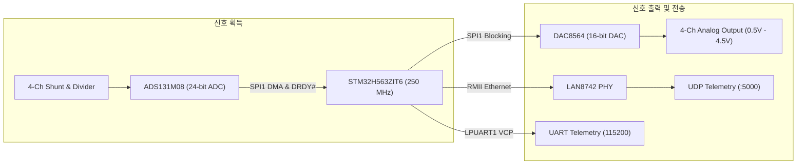
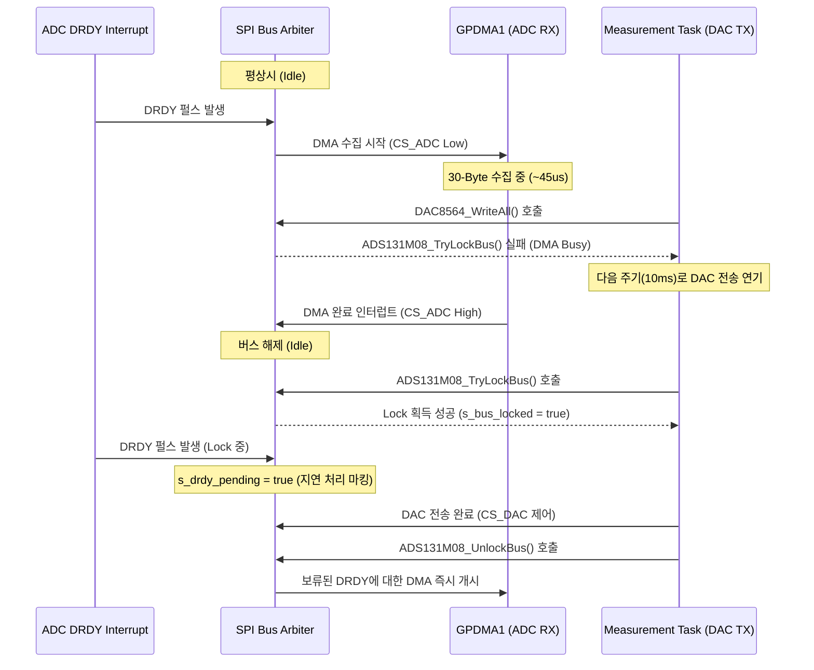
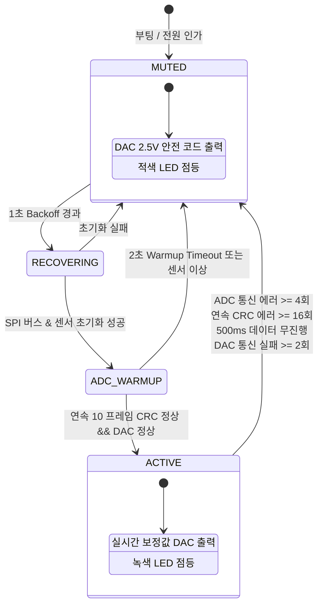

# COSMOKE H563 펌웨어 아키텍처 (Firmware Architecture)

본 문서는 STM32H563 기반 COSMOKE 센서 모듈 펌웨어의 내부 구조, 실시간 데이터 경로, 상태 머신, 태스크 스케줄링, 공유 버스 동기화 및 방어적 고장 복구 설계를 상세히 기술합니다.

---

## 1. 시스템 개요 및 하드웨어 구성

COSMOKE 펌웨어는 고전압·대전류 계측 신호를 안전하고 정확하게 수집하여 실시간 아날로그 제어 신호로 출력하고, 동시에 네트워크 관제 시스템으로 전송하는 실시간 임베디드 시스템입니다.



---

## 2. 실시간 데이터 파이프라인 (Real-Time Pipeline)

```text
[ADS131M08 하드웨어 (2,000 SPS)]
       │
       ▼ (DRDY# Falling Edge)
[EXTI3 ISR (우선순위 0,0)]
       │  - 공유 버스 상태(s_bus_locked) 및 DMA 활성(s_dma_busy) 점검
       ▼  - HAL_SPI_TransmitReceive_DMA (30 bytes, ~45 us 소요)
[GPDMA1 SPI1 완성 인터럽트 (우선순위 0,0)]
       │  - CS_N High 비활성화
       ▼  - 256-Frame Lock-Free 원형 링버퍼 삽입 (DMB 배리어 적용)
[ThreadX Measurement Task (Priority 5, 100 Hz)]
       │  - 링버퍼에서 프레임 순차 인출
       │  - CRC-16/CCITT 검증
       │  - Raw Count -> Engineering Units 변환 (영점/스케일/오프셋 보정)
       │  - 1차 IIR 저역통과 필터링 (Alpha = 0.05)
       │  - DAC 코드 생성 (±FS 기준 0.5V~4.5V 스팬)
       │  - FSM 상태 검사 및 고장 진단
       ▼
 ┌─────┴───────────────────────────────────┐
 │                                         │
 ▼                                         ▼
[DAC8564 출력 (100 Hz)]          [Telemetry 스냅샷 메일박스]
 - Bus Lock 획득 후 블로킹 전송    - Mutex 보호 버퍼 복사
 - 4채널 동시 업데이트             - Event Flag 트리거
                                           │
                                           ▼
                                [LAN Telemetry Task (Priority 8)]
                                 - NetX Duo UDP 소켓 전송 (10 Hz)
```

---

## 3. ThreadX RTOS 및 태스크 구성

시스템은 Azure RTOS (ThreadX) 기반의 선점형 멀티태스킹으로 동작합니다. 태스크 우선순위는 실시간성과 데이터 무결성을 보장하도록 다음과 같이 계층화되어 있습니다.

| 태스크명 | 스택 크기 | 우선순위 | 주기 | 역할 |
|---|---|---|---|---|
| **NetX IP Core Task** | 2,048 B | 4 (최상위) | Event | NetX Duo IP 스택, ARP, ICMP, 패킷 풀 관리 |
| **Measurement Task** | 4,096 B | 5 (중간) | 10 ms (100 Hz) | 링버퍼 소비, 보정·필터링, DAC 출력, FSM, 워치독 갱신 |
| **LAN Telemetry Task** | 3,072 B | 8 (하위) | Event / 100 ms | 텔레메트리 프레임 빌드, UDP 패킷 송신, 링크 감시 |

### 인터럽트 우선순위 설계

- **EXTI3 (ADC DRDY#)**: Preemption 0, Sub-priority 0 (최고 우선순위 - 지연 없는 DMA 트리거)
- **SPI1 DMA Transfer Complete**: Preemption 0, Sub-priority 0
- **ETH Interrupt**: Preemption 5, Sub-priority 0 (네트워크 버스트가 ADC 계측 지연을 유발하지 않도록 격리)

---

## 4. 공유 SPI 버스 중재 및 동시성 제어 (Shared SPI Arbitration)

ADS131M08 (ADC)와 DAC8564 (DAC)는 동일한 `SPI1` 컨트롤러를 공유합니다. ADC는 고속 비동기 DMA(30 bytes)를 사용하고, DAC는 주기적 동기 블로킹 전송(12 bytes)을 사용하므로 하드웨어 충돌을 방지하기 위한 중재 계층이 구현되어 있습니다.



---

## 5. 유한 상태 머신 (FSM) 및 고장 감시

펌웨어는 센서의 안전성을 위해 4단계의 엄격한 상태 머신을 유지합니다.



### 전이 조건 요약

1. **`MUTED`**:
   - DAC는 안전 중앙값($2.5\text{ V}$, Code `32768`)을 강제 출력합니다.
   - 1,000 ms 백오프 주기를 두고 `RECOVERING` 단계로 진입합니다.
2. **`RECOVERING`**:
   - DRDY 인터럽트를 비활성화하고 진행 중인 DMA를 강제 취소(`HAL_SPI_Abort`)합니다.
   - `SPI1`, `ADS131M08`, `DAC8564`를 하드웨어 리셋 및 재초기화합니다.
3. **`ADC_WARMUP`**:
   - 정상 CRC를 포함한 유효 프레임이 연속 10개 수신되고 DAC Health가 확인될 때까지 대기합니다 (최대 2초).
4. **`ACTIVE`**:
   - 정상 동작 상태로, 보정 및 필터링된 측정값이 DAC 및 텔레메트리로 송출됩니다.

---

## 6. 이중 하트비트 워치독 슈퍼바이저 (Dual-Heartbeat IWDG)

마이크로컨트롤러의 독립 워치독(IWDG)은 LSI 발진기(~32 kHz)를 소스로 사용하며 타임아웃은 **1,000 ms**로 설정됩니다.

단순 메인 루프 킥 방식이 아닌, **계측 태스크**와 **네트워크 태스크**의 생존을 개별적으로 검증하는 이중 하트비트 방식을 사용합니다:

$$\text{Can Refresh WDG} = (T_{\text{now}} - T_{\text{meas}} < 400\text{ ms}) \land (T_{\text{now}} - T_{\text{net}} < 2500\text{ ms})$$

> **네트워크 결함 분리 원칙**:  
> LAN 케이블 분리, IP 미할당 또는 네트워크 전송 지연이 발생하더라도 계측 태스크는 계속 동작해야 하며, 불필요한 시스템 리셋 루프가 발생하지 않도록 네트워크 타임아웃 마진은 2.5초로 여유 있게 관리됩니다.

---

## 7. 네트워크 및 케이블 핫플러그 복구 메커니즘

NetX Duo와 STM32 Ethernet 드라이버 환경에서 부팅 시 케이블이 연결되어 있지 않으면 드라이버 링크 활성화가 누락될 수 있습니다.

`app_netxduo.c`는 `EnsureDriverLinkEnabled()` 함수를 통해 다음 로직을 주기적으로 실행합니다:
1. `nx_ip_status_check`로 물리 계층(PHY)의 링크 상태를 지속 폴링.
2. 케이블 삽입으로 PHY 링크가 감지되면, 드라이버에 `NX_LINK_ENABLE` 커맨드를 비동기로 재전달.
3. MCU의 재부팅 없이도 이더넷 통신이 즉시 정상 복구됩니다.
