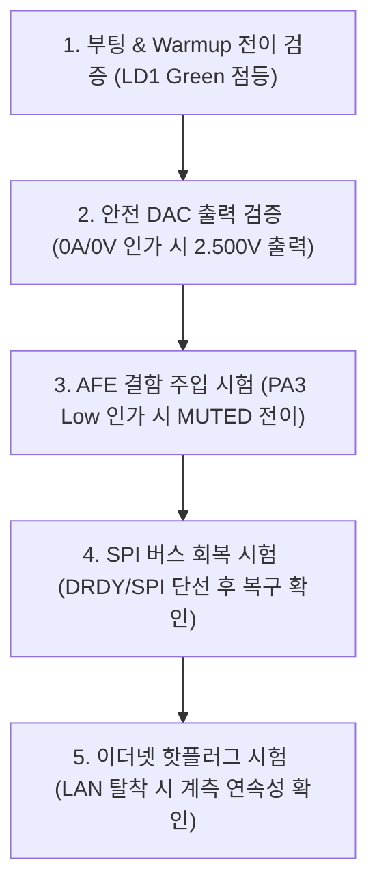

# COSMOKE H563 운영 및 시험 가이드 (Operations & Bench Guide)

본 문서는 COSMOKE H563 펌웨어의 빌드, 하드웨어 플래시, 벤치 검증, 실시간 텔레메트리 로깅, 센서 교정(Calibration) 및 실운용 배포 절차를 안내합니다.

---

## 1. 사전 준비 사항 (Prerequisites)

### 1.1 하드웨어 준비
- **NUCLEO-H563ZI** 평가 보드
- **COSMOKE 아날로그 프론트엔드(AFE) 모듈** (ADS131M08 + DAC8564 탑재)
- ST-LINK V3 연결용 Micro-USB 또는 USB-C 케이블
- 100 Mbps 지원 RJ45 이더넷 케이블 (PC 또는 관제 스위치 허브 연결)
- 정밀 직류 전원 공급기 (DC Power Supply) 및 고정밀 디지털 멀티미터 (DMM / 6.5-digit 권장)

### 1.2 소프트웨어 툴체인
- Windows 10/11 (PowerShell 5.1 이상)
- **STM32CubeCLT** 또는 **GNU Arm Embedded Toolchain** (`arm-none-eabi-gcc` 12.3+)
- **CMake** 3.22+ 및 **Ninja** 빌드 시스템
- **STM32CubeProgrammer** CLI (`STM32_Programmer_CLI.exe`)
- **Python 3.9+** (표준 라이브러리 `tkinter` 포함)

---

## 2. 빌드 및 플래시 (Build & Flash)

모든 작업은 프로젝트 루트 디렉터리(`c:\stm32\COSMOKE_H563`)에서 실행합니다.

### 2.1 펌웨어 빌드
```powershell
# Debug 빌드 수행 (ELF, HEX, BIN 파일 생성)
make build
```
- 빌드 산출물 위치: `build/firmware-debug/`
  - `COSMOKE_H563.elf`
  - `COSMOKE_H563.hex`
  - `COSMOKE_H563.bin`

### 2.2 하드웨어 연결 확인
```powershell
# ST-LINK SWD 연결 상태 및 타깃 전원 확인
make connect
```

### 2.3 펌웨어 플래시 및 MCU 리셋
```powershell
# 펌웨어를 MCU 플래시 메모리에 기록하고 검증한 뒤 자동 리셋
make flash
```

---

## 3. 실시간 관제 및 텔레메트리 수신 (Monitoring)

### 3.1 GUI 실시간 대시보드 (추천)
```powershell
make gui
# 또는 python .\Tools\cosmoke_dashboard.py
```


- **4채널 실시간 계측 카드**: 전류(A / mA), 전압(V / mV) 실시간 표시
- **스파크라인 트렌드 차트**: 최근 120개 데이터 포인트 실시간 그래픽 파형 렌더링
- **상태 및 플래그 모니터**: `ACTIVE`, `WARMUP`, `MUTED`, AFE Fault, Link 상태 실시간 디코딩
- **원클릭 CSV 자동 저장**: 대시보드 실행 시 `logs/` 폴더에 타임스탬프 기반 CSV 자동 기록 및 중단/재개 제어

### 3.2 콘솔 UDP 모니터링
```powershell
# 플래그 디코딩을 포함한 실시간 콘솔 출력
python .\Tools\cosmoke_udp_monitor.py --show-flags

# 특정 파일로 캡처 저장
python .\Tools\cosmoke_udp_monitor.py --csv-out .\logs\soak_test_01.csv --show-flags
```

### 3.3 시리얼(UART) VCP 모니터링
```powershell
# ST-LINK Virtual COM 포트 (예: COM7) 수신
python .\Tools\cosmoke_serial_monitor.py COM7 --baud 115200
```

---

## 4. 벤치 시험 및 안전 검증 절차 (Bench Validation)

실제 고전압·대전류 부하를 인가하기 전, 반드시 다음 5단계 벤치 검증을 수행하십시오.



### Step 1. 부팅 및 상태 전이 검증
1. ST-LINK 전원을 켭니다.
2. 보드의 **LD3(Red LED)**가 약 0.1~0.5초간 점등(`WARMUP`) 후 소등되고, **LD1(Green LED)**가 켜지며 `ACTIVE` 상태로 전환되는지 확인합니다.
3. 대시보드에서 `flags: 0x0001 (VALID)`가 수신되는지 확인합니다.

### Step 2. 무부하 영점 및 안전 DAC 출력 확인
1. 4채널 입력에 0 V / 0 A(개방 상태)를 유지합니다.
2. DAC 출력 4채널(`I1_OUT`, `V1_OUT`, `I2_OUT`, `V2_OUT`)의 전압을 DMM으로 측정합니다.
3. 정확히 **$2.500\text{ V} \pm 10\text{ mV}$** (Code 32768)가 출력되는지 확인합니다.

### Step 3. 하드웨어 AFE Fault 주입 시험
1. `PA3` (`SENSOR_FAULT_N`) 핀을 GND로 단락시킵니다.
2. 대시보드에 `AFE_FAULT` 및 `MUTED` 플래그가 발생하고 **LD3(Red LED)**가 켜지는지 확인합니다.
3. 단락을 해제하면 자동으로 `WARMUP`을 거쳐 `ACTIVE`로 복귀하는지 확인합니다.

### Step 4. SPI 통신 에러 및 자동 복구 시험
1. ADS131M08의 DRDY 신호선을 일시적으로 분리하거나 접지합니다.
2. 500 ms 이내에 데이터 무진행 타임아웃이 발생하여 `MUTED` 상태로 진입하고 DAC 출력이 $2.5\text{ V}$로 고정되는지 확인합니다.
3. 신호선을 다시 연결하면 1초 이내에 `SPI Recovery Gate`가 작동하여 버스를 재초기화하고 정상 복구되는지 확인합니다.

### Step 5. 이더넷 케이블 핫플러그 시험
1. 동작 중 RJ45 LAN 케이블을 분리합니다.
2. 계측 태스크가 중단되지 않고 DAC 아날로그 출력이 계속 유지되는지 확인합니다. (워치독 리셋이 발생하지 않아야 함)
3. LAN 케이블을 다시 연결했을 때 수 초 이내에 UDP 텔레메트리가 자동으로 재개되는지 확인합니다.

---

## 5. 채널 교정 가이드 (Calibration Workflow)

정밀 측정을 위해 `Core/Inc/app_config.h`에서 채널별 오프셋 및 스케일 계수를 교정합니다.

### 5.1 영점(Zero Offset) 교정 절차
1. 센서 입력을 0 A / 0 V로 안정화하고 10분간 웜업합니다.
2. 대시보드 또는 UDP 모니터로 약 10초간 데이터를 수집합니다.
3. 계측된 잔류 평균값이 $+0.0125\text{ A}$라면, 해당 채널의 `OFFSET_UNITS`를 부호 반전하여 설정합니다:
   ```c
   #define APP_CH0_OFFSET_UNITS (-0.012500f)
   ```

### 5.2 스팬(Scale Trim) 교정 절차
1. 정밀 기준 소스로 풀스케일의 약 50%~80% (예: $15.000\text{ A}$, $100.00\text{ V}$)를 인가합니다.
2. 기준 장비 측정값($V_{\text{ref}}$)과 펌웨어 표시값($V_{\text{meas}}$)을 비교합니다:
   $$\text{New Scale Trim} = \text{Current Scale Trim} \times \frac{V_{\text{ref}}}{V_{\text{meas}}}$$
3. 계산된 값을 `Core/Inc/app_config.h`의 `APP_CHx_SCALE_TRIM`에 반영 후 재빌드 및 플래시합니다.

---

## 6. 양산 및 실운용 배포 수칙 (Production Deployment)

1. **UDP 유니캐스트 설정**:  
   기본 브로드캐스트(`255.255.255.255`) 대신 관제 PC의 고정 IP로 변경하여 네트워크 부하 및 보안성을 확보하십시오.
   ```c
   #define APP_NETWORK_UDP_DESTINATION_0 (192u)
   #define APP_NETWORK_UDP_DESTINATION_1 (168u)
   #define APP_NETWORK_UDP_DESTINATION_2 (0u)
   #define APP_NETWORK_UDP_DESTINATION_3 (100u)
   ```
2. **독립 계측망 구축**:  
   사내 공용망 대신 계측 전용 VLAN 또는 스위치 허브를 구성하여 패킷 유실을 방지하십시오.
3. **하드웨어 MUTE 라인 연동**:  
   소프트웨어 안전 코드 외에, 시스템 비상 정지(E-Stop) 회로와 하드웨어 MUTE GPIO를 연동하여 2중 안전장치를 확보하십시오.
